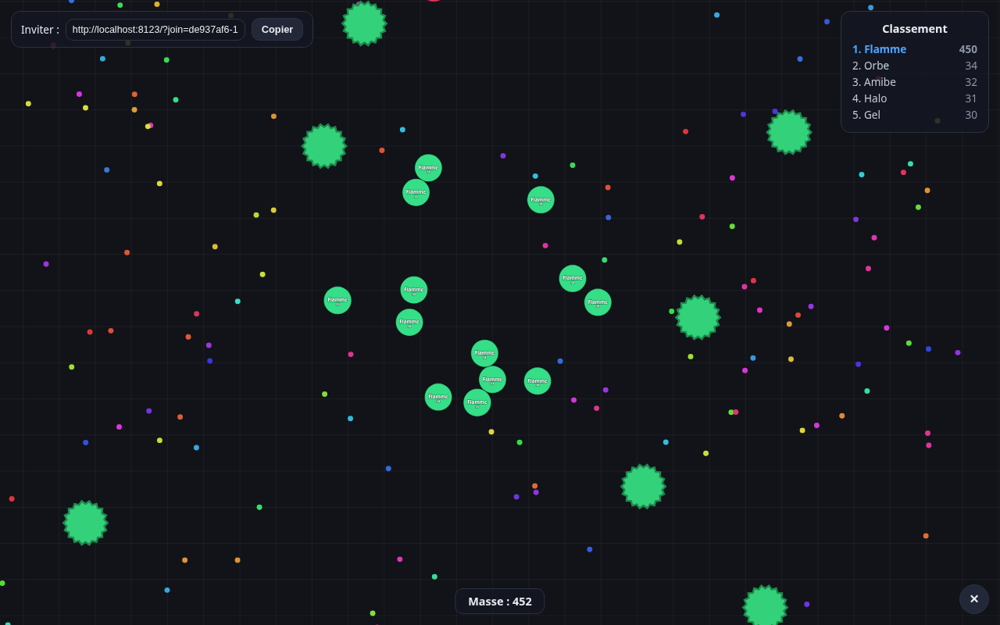

# Blobule

🇫🇷 [Version française](README.fr.md)

A free, open source [agar.io](https://agar.io) clone with **no game server**:
everything runs in the browser, peer-to-peer over WebRTC.



## How it works

- **The host is the server.** The player who creates the game runs the whole
  simulation in their browser. No backend to deploy or pay for.
- **Pick the number of players** (2 to 12). Every seat without a human is
  played by an AI bot.
- **Invite by link.** The host shares a link (or a code); when a friend joins,
  they replace a bot. When they leave, a bot takes the seat back.
- The public [PeerJS](https://peerjs.com) server is only used for the initial
  WebRTC handshake (signaling) — no game data ever goes through it.

## Play

The easiest way is the GitHub Pages build:
**<https://flamme-demon.github.io/blobule/>**

### Locally (solo + bots)

Just open `index.html` in a browser, or run a tiny static server:

```bash
python3 -m http.server 8080
# then http://localhost:8080
```

### Invite friends from home (tunnel)

No port forwarding needed: gameplay runs over WebRTC, which punches through
routers and NAT on its own. Your friends only need to be able to load the
game **page**. If you don't use the GitHub Pages build, a tunnel does the job:

```bash
python3 -m http.server 8123 &          # serve the game locally
cloudflared tunnel --url http://localhost:8123
# → prints a URL like https://xxxx.trycloudflare.com
```

Open that URL (not localhost!) and create your game: the generated invite
link then works for everyone, as long as the tunnel stays open. Zero-install
alternative (short anonymous sessions):
`ssh -R 80:localhost:8123 -o ServerAliveInterval=30 nokey@localhost.run`.

If the tunnel dies mid-game, connected players are **not** kicked: the game
runs over direct browser-to-browser WebRTC. Only new joiners need the page
to be reachable.

## Controls

| Input   | Action              |
|---------|---------------------|
| Mouse   | Steer your cells    |
| `Space` | Split               |
| `W`     | Eject mass          |

## Mechanics

- Eat food and smaller players (at least 25% mass advantage required) to
  grow; speed decreases as you get bigger.
- Split in two (up to 16 cells), launched toward the cursor; cells can
  re-merge after a cooldown by gathering them together.
- Eject mass to bait opponents, feed a teammate… or a virus.
- Viruses (green): a big cell touching one explodes into pieces. Feed a
  virus 7 ejections and it visibly swells, then splits, shooting out a new
  virus — a fine trap for the big ones.
- Gradual mass decay, live leaderboard, respawn on demand.

## Architecture

```
index.html      UI (menu, HUD)
style.css
js/config.js    constants and formulas (radius, speed, merging)
js/sim.js       world simulation + bot AI (DOM-free, testable under Node)
js/render.js    canvas rendering + camera
js/net.js       PeerJS P2P: authoritative host, guests send inputs / get state
js/main.js      menu, game loop, inputs, HUD
```

The host broadcasts ~15 snapshots/s (~1–2 KB each); guests only send their
mouse target and actions. Food is synced as diffs (added/removed), never
retransmitted in full.

## Known limitations

- If the host closes their tab, the game ends for everyone.
- Signaling relies on the free public PeerJS server; you can self-host
  [peerjs-server](https://github.com/peers/peerjs-server) if needed.
- No touch (mobile) support yet — contributions welcome!

## License

[MIT](LICENSE) — do whatever you want with it.

Blobule is an independent project, not affiliated with Miniclip or agar.io.
